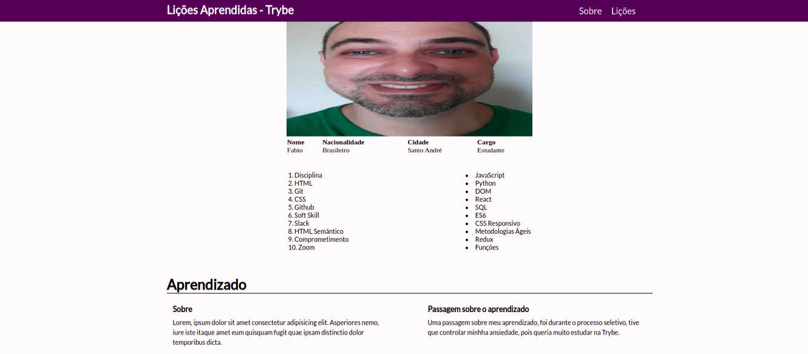

# Dia 5 📆

### Neste dia aprendi:

* Entender como funciona a estrutura (HTML) de uma página
* Construir páginas utilizando HTML e CSS
* Realizar manutenções em páginas já existentes
* Aplicar Layout e Box Model na prática

## Projeto 1 - Lesson Learned 🚀

