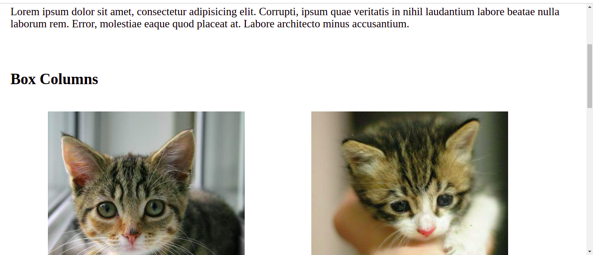
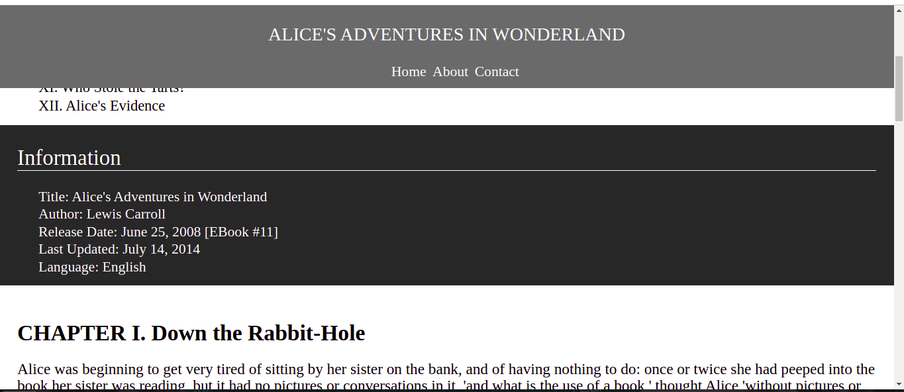
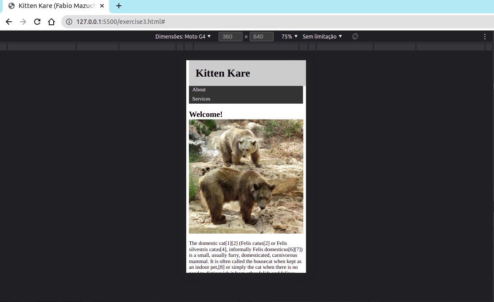

### Parte I - Criar uma página para uma tela pequena

### Parte II - Criando 3 layouts diferentes utilizando o mobile first

### Parte III - Criando layouts para dispositivos móveis e para impressão

